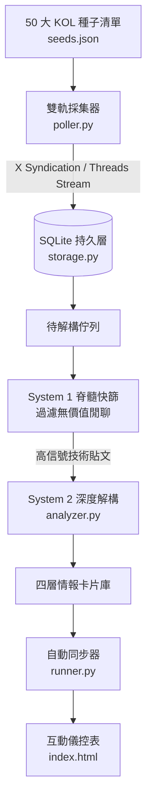

# ⚡ AI 社群第一手情報雷達 (AI Social Intel Radar)

> **X (Twitter) & Threads (脆) 雙軌情報巡邏與雙核 Agent 深度解構系統**

本專案是一個專為 AI 研究者、開發者與內容創作者打造的第一手社群情資獵手。透過免登入、零封鎖風險的即時端點，定時巡邏全球頂尖研究員 (X) 與繁中一線實踐者 (Threads)，並透過**雙核 Agent 管線（System 1 脊髓降噪 + System 2 深度解構）**將碎片化推文層層剝離為具備高度行動價值的情報卡片。

---

## 🌟 核心特色

1. **雙平台雙軌監控**：
   * **X (Twitter) 原爆點**：即時追蹤全球技術先鋒（如 Andrej Karpathy、swyx、Simon Willison），捕捉新架構、開源 Repo 與評測爭議。
   * **Threads (脆) 落地點**：即時追蹤繁中一線架構師（如 ihower 葉平、Will 保哥），捕捉在地商業落地與地端實戰反饋。
2. **免登入、零風控採集引擎**：
   * 採用 X 官方公開 Syndication 端點與 Threads 即時渲染管線，徹底告別傳統影子瀏覽器彈窗與 403 阻擋。
3. **雙核 Agent 解構管線**：
   * **第一層（System 1 脊髓快篩）**：自動過濾日常問候、抽獎與純閒聊廢文。
   * **第二層（System 2 深度解析）**：自動提煉出：
     * **30 秒速讀事實 (Core Fact)**
     * **技術架構本質 (Core Thesis)**
     * **社群正反論辯 (Community Sentiment: Pro vs Con)**
     * **時間差利基 (Information Arbitrage: X 領先繁中圈幾小時)**
     * **行動指引 (Actionable Takeaway)**
4. **精美 Web App 儀控表**：
   * 扁平深色主題、即時關鍵字過濾、平台/等級切換、滑出式四層解構抽屜。

---

## 🏗️ 系統架構



---

## 🚀 快速開始

### 1. 安裝環境依賴

```bash
git clone https://github.com/kevinz1979/ai-intel-radar.git
cd ai-intel-radar
pip install -r requirements.txt
```

### 2. 執行一次即時巡邏循環

```bash
python runner.py
```

執行後代理人將自動：
1. 依序巡邏 X 與 Threads 上的種子人物。
2. 進行排重與雜訊過濾。
3. 生成最新情報卡片並寫入 `intel_radar.db`。
4. 自動將卡片同步注入 `index.html`。

### 3. 開啟情報儀控表

直接在瀏覽器開啟專案目錄下的 `index.html` 即可檢視！

---

## 📁 檔案結構

* `seeds.json`：50 位核心 KOL 名單與領域標籤配置。
* `poller.py`：X 與 Threads 免登入採集引擎。
* `storage.py`：SQLite 資料庫持久層（種子、貼文、情資報告）。
* `analyzer.py`：雙核 Agent 提煉器（支援 Gemini 結構化輸出與本地啟發式備援）。
* `runner.py`：主巡邏管線與 Web 儀控表同步器。
* `index.html`：可互動的 Web App 前端儀控表。

---

## 📄 License

MIT License.
